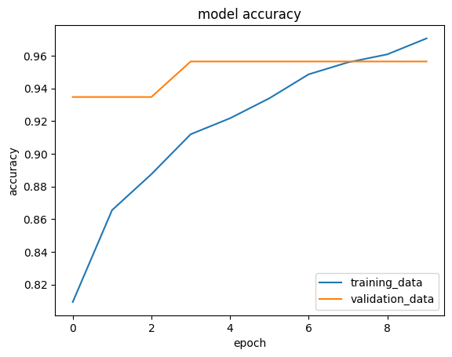
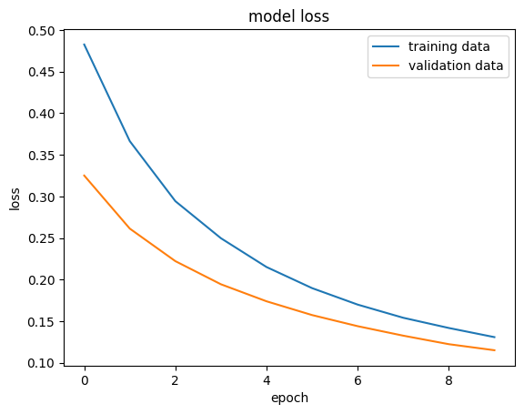

## Veri Seti Hakkında

Bu projede kullanılan veri seti, Scikit-learn kütüphanesinde bulunan `load_breast_cancer()` fonksiyonundan elde edilen Breast Cancer (Diagnostic) veri setidir. Veri seti, kanser hücrelerinin iyi huylu (benign) veya kötü huylu (malignant) olup olmadığını tahmin etmek üzere tasarlanmış bir sınıflandırma problemidir.





### Veri Setinin İçeriği

- **Örnek sayısı**: 569
- **Özellik sayısı**: 30 (sayısal özellikler)
- **Sınıflar**: 2(İyi huylu kötü huylu)
- **Eksik veri**: Bulunmamaktadır.
- **Veri kaynağı**: UCI Machine Learning Repository

### Özellikler

Her bir veri noktası aşağıdaki tip özellikleri içermektedir:

- Ortalama (mean)
- Standart hata (standard error)
- En kötü durum (worst case)

Özellikler, hücre çekirdekleri ile ilgili özellikleri içermektedir; örneğin yarıçap, doku, çevre, alan, pürüzsüzlük, yoğunluk vb.

## Yapay Sinir Ağı (Neural Network) Modeli

Bu proje kapsamında Python ile aşağıdaki işlemler gerçekleştirilmiştir:

1. Veri ön işleme
2. Veri setinin eğitim ve test alt kümelerine ayrılması
3. Yapay sinir ağı modelinin oluşturulması ve eğitimi
4. Modelin performans değerlendirmesi (accuracy, precision, recall, f1-score gibi metriklerle)

### Kullanılan Teknolojiler

- Python
- Scikit-learn
- TensorFlow veya Keras (yapay sinir ağı oluşturmak için)
- Pandas, NumPy

## Kurulum ve Kullanım

Projenin çalıştırılması için aşağıdaki adımları takip ediniz:

```bash
git clone https://github.com/mustafaklee/Cancer-Classification-simple-Neural-Network.git
cd Cancer-Classification-simple-Neural-Network
pip install -r requirements.txt
python model.py
```
